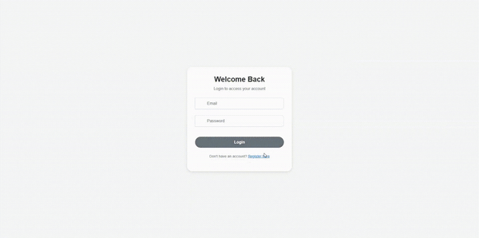
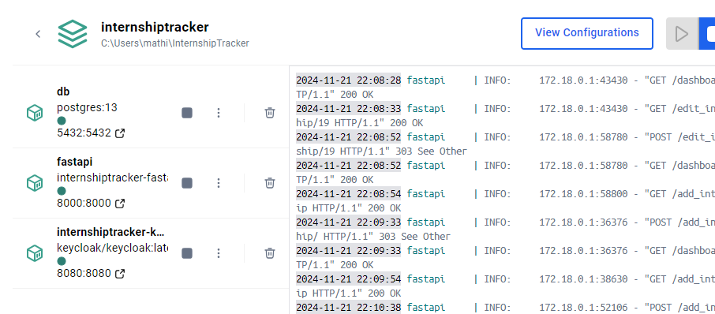
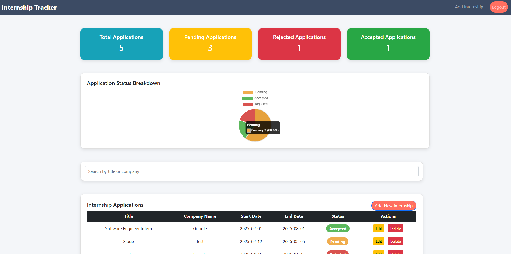
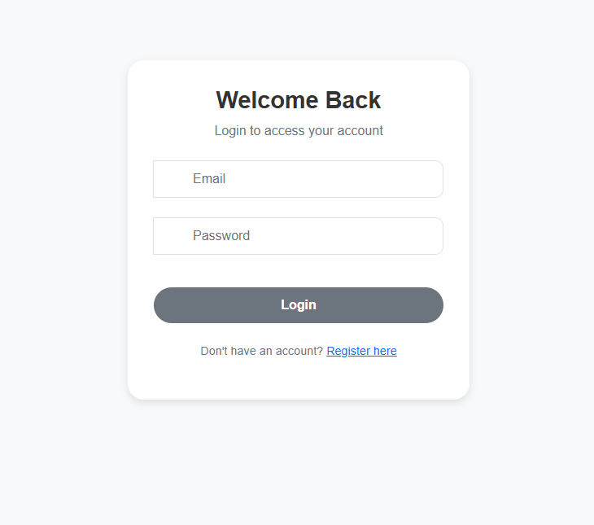
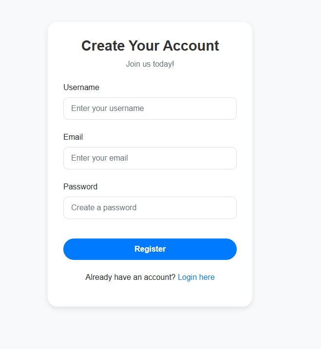
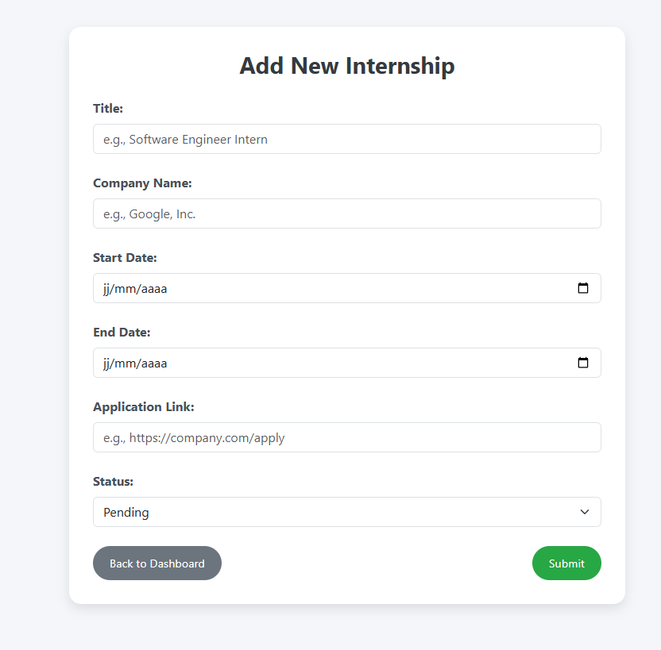
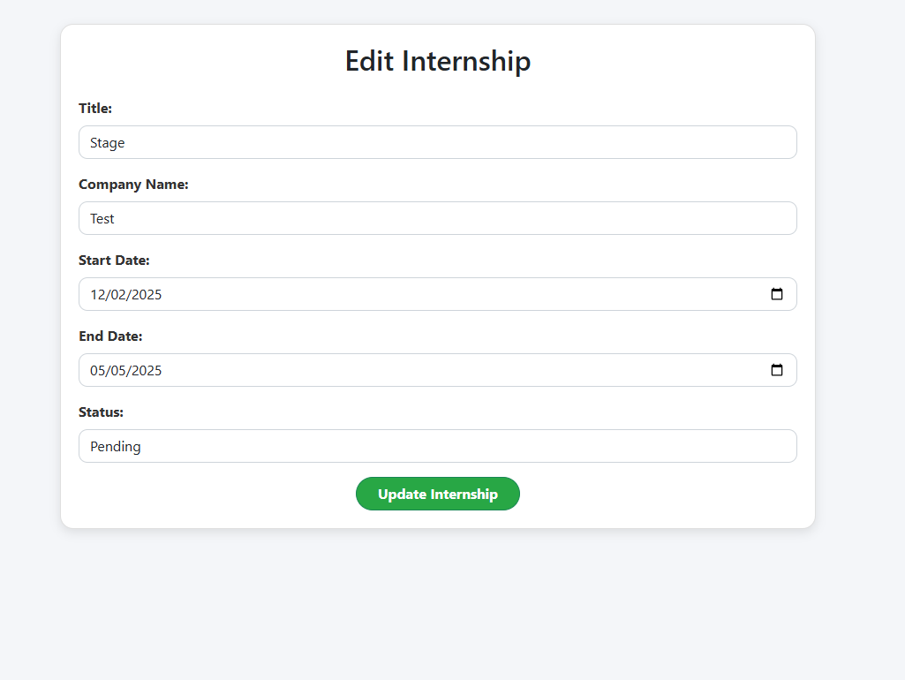

# Internship Tracker

Our **Internship Tracker** project is a full-stack application designed to manage internship applications. It allows users to register via an account creation, log in and manage their internship files while tracking the status of the applications. The project is containerized using Docker for easy deployment.


<br>
<br>
<br>

<p align="center">
  
</p>


<br>
<br>
<br>


---

## Table of contents

### User Guide
1) [Prerequisites](#1---prerequisites)
2) [Launch the application](#2---lauch-the-application)
3) [Features](#3---features)


### Developper Guide
1) [Directory Structure](#1---directory-structure)
2) [Technologies Used](#2---technologies-used)
3) [Configuration](#3---configuration)
4) [Running Locally](#4---running-locally)
5) [Accessing the Database](#5---accessing-the-database)
6) [API Endpoints](#6---api-endpoints)

### Conclusion
1) [Why this idea](#1---why-this-idea)
2) [Contributions](#2---contributions)


---

## User Guide

### 1 - Prerequisites

Before launching the application, you must have downloaded **[Docker Desktop](https://docs.docker.com/desktop/setup/install/windows-install/)** from the official website. And also **Git** in order to clone the project on your local machine.

---


### 2 - Launch the application

After installing the prerequisites, you will be able to launch our application. To do this, you have to open a terminal and follow the following commands.

#### 1. Clone the Repository
```bash
git clone https://github.com/bysocode/InternshipTracker.git
cd InternshipTracker
```

#### 2. Build and Start Docker Containers
Run the following command in your terminal to build and start the application:
```bash
docker-compose up --build
```

You should now see containers being built on your docker desktop.

<br>
<br>



<br>
<br>


#### 3. Access the Application
- The FastAPI application will be available at `http://localhost:8000`.
- Use the provided UI to register and start managing internships.

<br>
<br>



<br>
<br>


---

### 3 - Features

Here are the main features that our project offers to its users:

- **User Management**:
  - Registration and secure login : Users can create accounts with hashed and encrypted passwords for security of the account.
  - Profile management : Update user details directly from the Dashboard.

    Here is the application when logging in and creating an account to then log in, then access the application:
    <br>
    <br>
    
    <br>
    <br>


    But if you don't have any account created for the moment, you need to create an account first with you name, email and password that you choose:

     <br>
     <br>
     <p align="center">
  
  </p>
     <br>
     <br>


  
- **Internship Management**:
  - **CRUD** operations : Add, view, edit, and delete internships. (CRUD is an acronym for the four basic operations an application can perform on data: **Create**, **Read**, **Update**, and **Delete**)
  - Allows you to complete detailed information of the internship.
  - Dashboard with application status breakdown (Pending, Accepted, Rejected).
  - Visual pie chart for application status.
 
    This is what the app looks like when you want to add a step to your user account.


    


    And When you want to edit a internship for certain reasons, like a date or status that changes, you can click on the "edit" button, then you change the necessary information, then you update your changes.


    


- **Admin Features**:
  - View all database content at `http://localhost:8000/view-all-db-page`.
  - Update (reset) all user passwords in bulk at `http://localhost:8000/set_all_passwords/{new_password}`.
 

    
---

## Developer Guide

### 1 - Directory Structure

```plaintext
.
├── Backend/                  # Backend services and initialization
│   ├── Dockerfile            # Dockerfile for the PostgreSQL setup
│   └── db-init/              # Database initialization scripts
│       └── init.sql          # SQL script to initialize the database
├── Frontend/                 # HTML templates for the user interface
│   ├── add_internship.html   # Add internship form
│   ├── dashboard.html        # User dashboard
│   ├── edit_internship.html  # Edit internship form
│   ├── login.html            # Login page
│   ├── profile.html          # User profile page
│   ├── register.html         # User registration page
│   └── view_all_db.html      # Admin page to view all database content
├── fastapi/                  # FastAPI application directory
│   ├── Dockerfile            # Dockerfile for the FastAPI service
│   ├── Frontend/             # Mount point for frontend templates
│   ├── main.py               # Main FastAPI application
│   └── requirements.txt      # Python dependencies for the backend
├── docker-compose.yml        # Docker Compose configuration
├── test.py                   # Script for testing and managing the application
└── README.md                 # Documentation
```


---

### 2 - Technologies Used

- **Backend**: **FastAPI**, a modern, fast and easy to use web framework for building APIs with Python. It offers high performance for user management and stages for the project.
  
- **Database**: **PostgreSQL**, stores user and internship data securely and robustly. It is containerized and directly on Docker for easy deployment.
  
- **Frontend**: **HTML templates** (Jinja2), which dynamically generate web pages and ensuring a smooth interface for the user using the application.
  
- **Session Management**: **Keycloak** for secure login and user management.
  
- **Authentication**: **JWT** and cookie-based sessions, ensuring secure authentication and data confidentiality.
  
- **Containerization**: **Docker** and **Docker Compose**, simplify the deployment and management of application environments.


---

### 3 - Configuration

#### Environment Variables

In the docker-compose.yml file, which will allow us to "launch" the entire project, the essential information. So, the configuration parameters which allow us to guarantee a good connection between the API service and the Postgres database
Database settings can be configured in `docker-compose.yml`:

```yaml
services:
  db:
    environment:
      POSTGRES_USER: postgres
      POSTGRES_PASSWORD: password
      POSTGRES_DB: internships_db
```

Ensure the FastAPI service connects to the database:
```python
DATABASE_URL = "postgresql://postgres:password@db:5432/internships_db"
```

#### Keycloak Configuration

Keycloak is configured to handle user authentication and user session management for our project. Initially, we implemented a code using JWT retrieval using a username / password as seen in class. Despite that this method is simple and effective, we still decided to use another way for authentication, with a Keycloak authentication system. The good thing about Keycloak is that it offers a robust and centralized management for user, role and session management and ensures enhanced security. It is useful for a project that can potentially evolve in the future or if we want to improve our project, because we can change the project without having to make many changes in the authentication system.


---

### 4 - Running Locally

To run the **FastAPI** service locally:
```bash
cd fastapi
uvicorn main:app --reload --host 0.0.0.0 --port 8000
```


---

### 5 - Accessing the Database

You can connect to the **PostgreSQL** container:
```bash
docker exec -it db psql -U postgres -d internships_db
```


---

### 6 - API Endpoints


#### User Management
- **Register**: `POST /register/`
  Allows new users to register by creating an account with a secure password.
  
- **Login**: `POST /login/`
  Allows existing users to log in using their credentials to access the application.
  
- **Profile**: `GET /profile`
  Retrieves information from the logged in user's profile, such as personal data and internship history.
  
- **Update Profile**: `POST /update_profile`
  Allows the user to update their personal information (name, email, etc.).


#### Internship Management
- **Dashboard**: `GET /dashboard`
  Displays the user dashboard, including an overview of internships, their status (pending, accepted, rejected), and visual graphs.
  
- **Add Internship**: `POST /add_internship/`
  Allows the user to add a new internship with relevant information like company, duration and application status.
  
- **Edit Internship**: `POST /edit_internship/{internship_id}`
  Allows the user to edit information for an existing internship, such as dates, company details or interships status.
  
- **Delete Internship**: `GET /delete_internship/{internship_id}`
  Allows the user to delete a specific stage from their dashboard.


#### Admin
- **Set All Passwords**: `GET /set_all_passwords/{new_password}`
  Allows the administrator to update all user passwords with one click, replacing the old one with a new one.
  
- **View All Database**: `GET /view-all-db-page`
  Allows the administrator to view the entire contents of the database, with all information about users and internships.


If you want to explore the available API endpoints interactively, you can access the **Swagger UI** at, you can understand the API logic and do tests directly on it:
**http://localhost:8000/docs**


---

### Conclusion

### 1 - Why this idea

We chose this topic because we were looking for an interesting topic that could match the requested instructions, with an authentication system. In addition, we have been in the middle of an internship search for several weeks and an application like this can help students like us to organize themselves well and get help thanks to a simple interface to track the status of their applications and manage their own information.


---

### 2 - Contributions

#### Contributions

Contributions are welcome! Fork the repository, create a branch, and submit a pull request. For major changes, please open an issue first to discuss your idea.


#### License

This project is licensed under the [MIT License](LICENSE).


---

## Author

Developed by **bysocode** (Julien-Aymar PHILEMY, E5AIC) and **mathisqc** (Mathis QUINIO-COSQUER, E5DSIA).

GitHub Repository: [https://github.com/mathisqc/InternshipTracker](https://github.com/bysocode/InternshipTracker)
